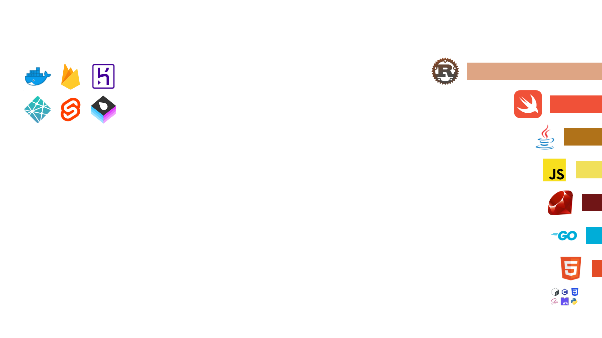

# Github Profile Image

Generate an image for your GitHub profile using a mix of GitHub statistics and your own information.

This program will run on a RaspberryPi for me, periodically updating the image.

## Customizing
You can customize the image by going into [`main/main.go`](main/main.go). All drawing implementation is done there. Other folders conntain core logic that doesn't affect where elements are drawn to.

Don't forget to make a [GitHub Api access token](https://docs.github.com/en/authentication/keeping-your-account-and-data-secure/creating-a-personal-access-token#creating-a-token) and either place a fall called `GH_TOKEN` in the [gh-api](gh-api) follder, or replace it in the code where needed.

Also don't forget to replace the font to a font file on your computer in [`main.go`](https://github.com/Jomy10/github-profile/blob/fe6e28d0f4d031964c58a32405784fb528fa8f22/main/main.go?plain=1#L44)

## License
Licensed under either the [MIT License](LICENSE) or [Boost Software License 1.0](LICENSE2), at your choosing.

